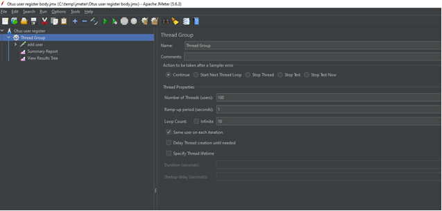
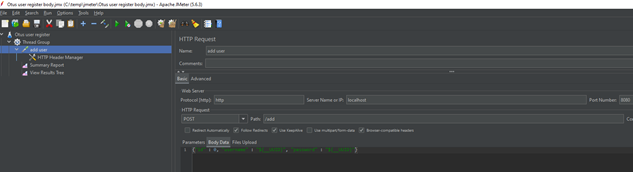
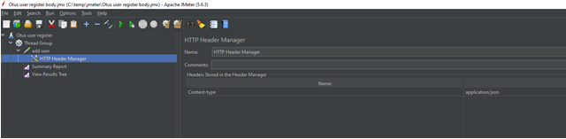
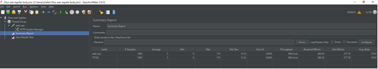
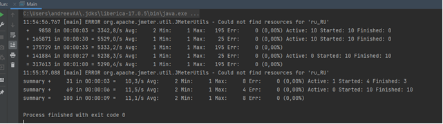

Домашнее задание Реализовать генератор нагрузки

Цель: Сделать генератор нагрузки для выбранного протокола

Описание/Пошаговая инструкция выполнения домашнего задания: Для выполнения задания потребуется сервис регистрации пользователя, реализованный ранее.

Создать тестовый план с регулиремым RPS.

1)Сделать тесты через UI-ный интерфейс Jmetera

2)Сделать тесты через отдельный подмодуль с библиотекой Jmeter.

При старте данного подмодуля jar должен запускаться и генерировать нагрузку на основное приложение

Запуск через UI-ный интерфейс Jmeter

Запуск через отдельный подмодуль с библиотекой Jmeter.

