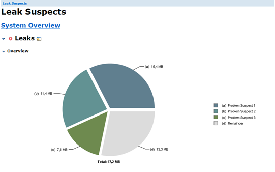
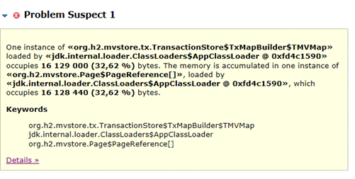
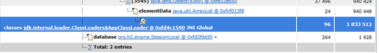
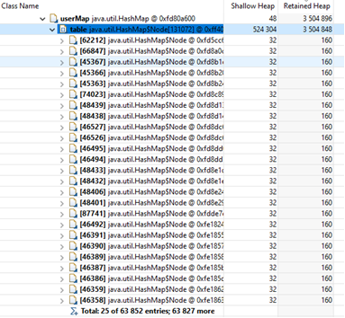
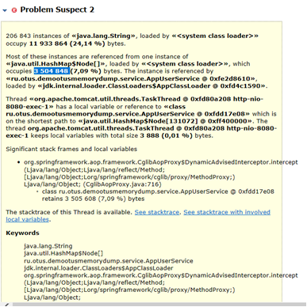

Домашнее задание
Поиск утечки памяти в приложении

Цель:
Создать тестовой приложение с утечкой памяти и найти её с помощью специальных инструментов

Описание/Пошаговая инструкция выполнения домашнего задания:

1. Реализоавть простое приложение на spring boot:

1.1 Сервис регистрации пользователя в системе: rest service принимающий login и password от пользователя

1.2 Для хранение данных использовать БД H2

1.3 Для доступа к данным использовать Spring JPA

2. Заложить проблему, вызывающую OutOfMemoryError. Примечание: приложение должно постепенно копить мусор в течение нескольких минут

3. Запускать приложение с инструкцией, позволяющей собирать дамп хипа перед падением

4. Провести анализ дампа инструментам Eclipse Memory Analyzer Tool, найти утечку, и предоставить скиншот того места, где можно сделать вывод об утечку (с комментариями, поясняющими почему вы считаете это место утечкой)

5. Поправить утечку памяти (отдельным коммитом в пулл реквесте).

Заложил проблему OutOfMemoryError через переполнение Map, в которую добавляются данные ползователей, перед регистрацией,
и не удаляются из нее.

1. Запускаем приложение.

2. Смотрим Eclipse Memory Analyzer Tool

Смотрим детали первой проблемы

Смотрим список объектов с сортировкой по «Retained Heap»
Находим самый «тяжелый» объект 

В проблеме 2, можно увидеть те же значения

Делаем вывод, что, вероятно, утечка памяти связана мапой.
Вносим исправление в код.