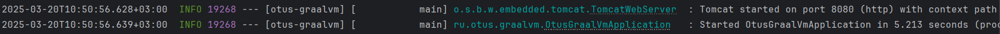
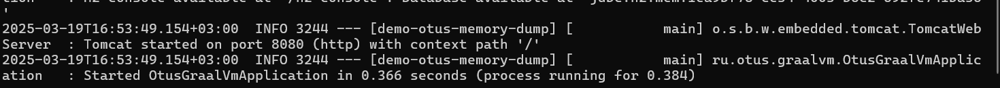
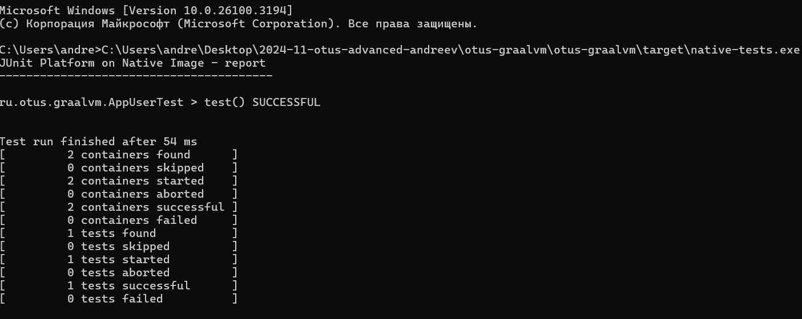

Домашнее задание
Анализ ускорения работы приложения при работе на GraalVM

Цель:
Запустить ранее написанное приложение на GraalVM и оценить время старта и работы приложения (ускорение по отношению к обычной имплементации java)

Описание/Пошаговая инструкция выполнения домашнего задания:

1. Реализовать простое приложение на Spring Boot 3 (из занятия Memory management. JVM memory structure)

2. Добавить плагин для сборки Native Image файлов

3. Выполнить сборку в Native Image

4. Запустить полученный файл и сравнить время запуска с запуском на JVM

5. Зафиксировать результаты (можно указать железо на котором выполнялся запуск)

6. Добавить простой unit тест и запустить nativeTestCompiler (Gradle)

7.* запустить файл в Docker

Запускаем приложение "обычным" сопособом 

Собираем native-image проиложение, запускаем получившийся exe-файл

Запуск гораздо быстрее, примерно, в 13-14 раз

Добавляем простой тест, собираем native-image тестов, запускаем получившийся exe-файл 

