Домашнее задание Диагностика приложения с помощью JFR

Цель: Реализовать тестовый пример, содержащий проблемы, которые потом продемонстрировать в JFR

Описание/Пошаговая инструкция выполнения домашнего задания:

Для выполнения задания потребуется сервис регистрации пользователя, реализованный ранее.

Написать тестовый профиль с использованием JMeter

Провести профилирование приложения с помощью JFR

Имитировать проблемы в приложении:

лишние исключения

лишние запросы в БД

ненужные блокировки synchronized или Lock

свои варианты

На основе анализа журнала JFR найти проблемы в приложении и обосовать, как прийти к такому заключению о проблемах. В отчёт можно включать скрини JMC, ссылки на исходный код."

Имитируем проблемы в приложении:

- лишние исключения

- лишние запросы в БД

- ненужные блокировки synchronized или Lock

1. Запускаем приложение
2. Даем нагрузку с помощью Jmeter

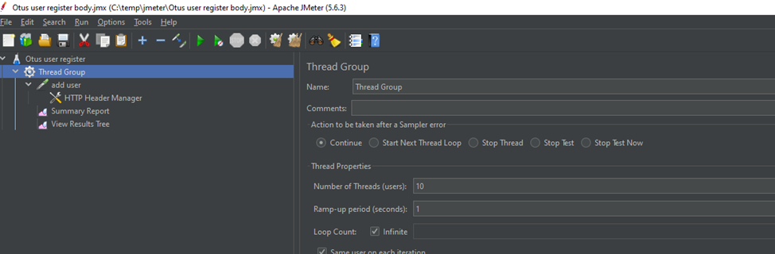

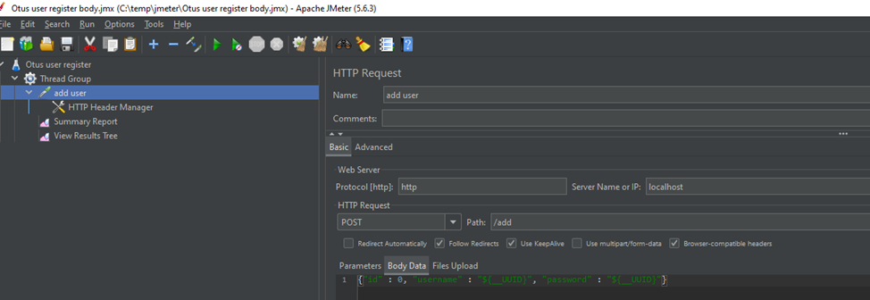

3. Запускаем Flight Recorder в JDK Mission Controller, получаем результат:

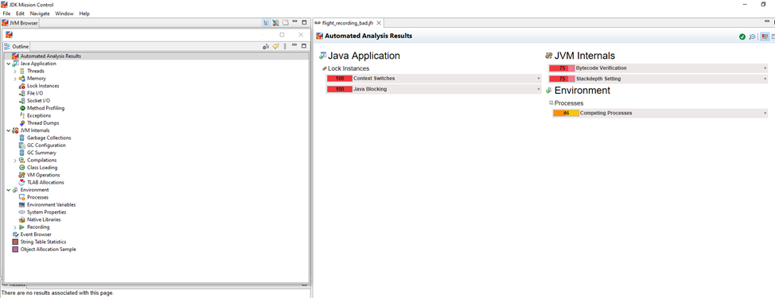

4. Сразу видим какие-то проблемы с блокировками

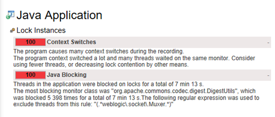

5. Смотрим Lock Instance для получения доп. информации по проблеме блокировок

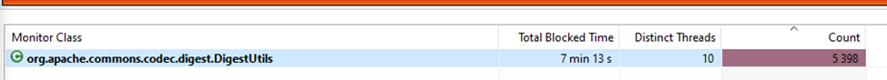

   Сразу видим проблемный объект, вносим исправление в код

6. Смотрим проблемы с Exception

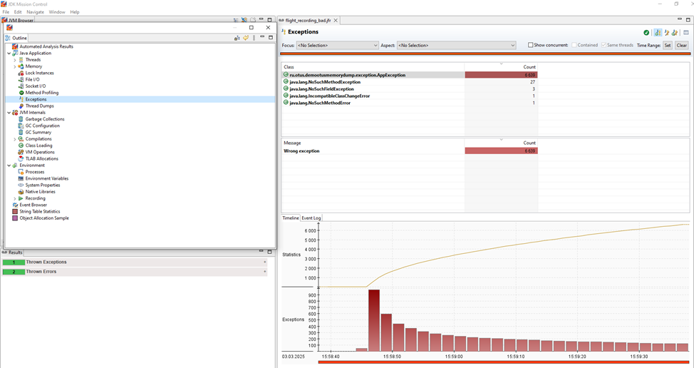

   Видим большое количество Exception-ов(AppException), при этом Jmeter показывает отсутствие ошибок по запросам

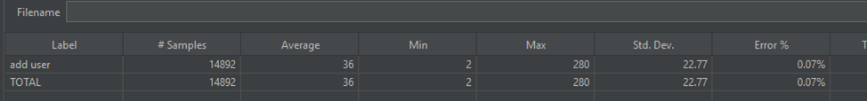

   Анализируем код по AppException, находим проблемное местов, делаем исправление в коде.

7. Смотрим Memory

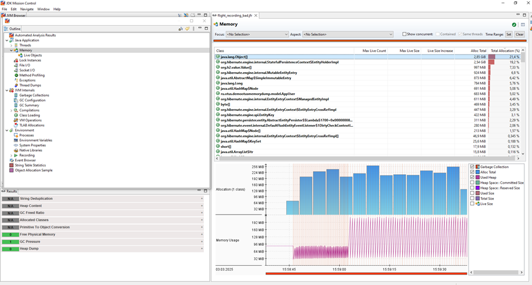

   Видим слишком большое выделение памяти на объекты нашей БД(h2) и hibernate

   Дополнительно смотрим Method Profiling

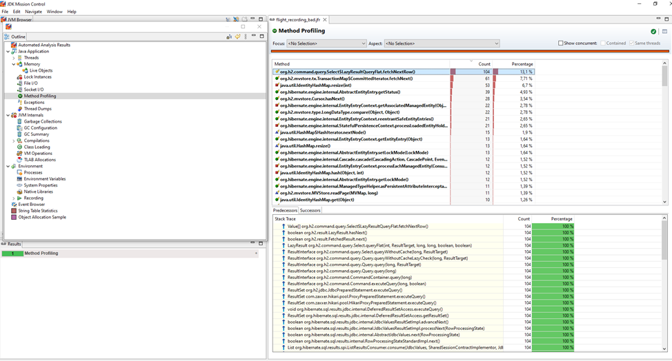

   Смотрим запись с самым большим Count и Percentage – это метод связанный с получение данных в БД, смотрим Stack Trace

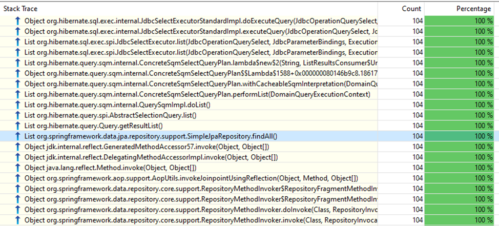

   Находим строчку с методом получения полного списка объектов из БД через репозиторий, чего не предполагалось логикой приложения, при регистрации пользователя – находим проблему в коде и делаем исправление.

После исправления видим отсутствие/улучшение проблемных мест приложения
   
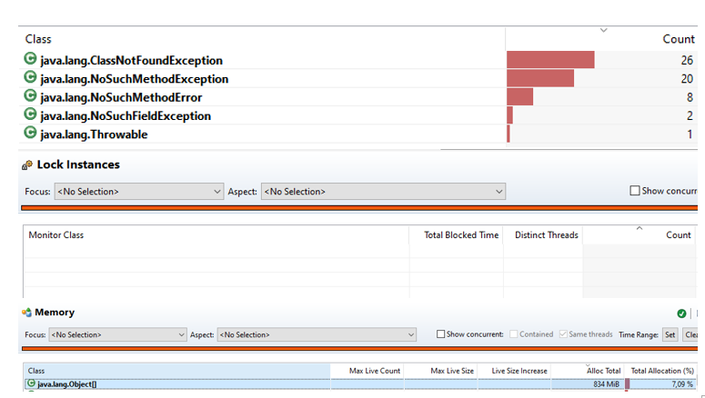