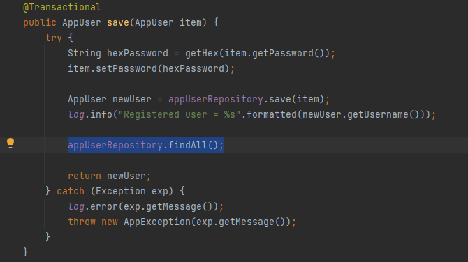
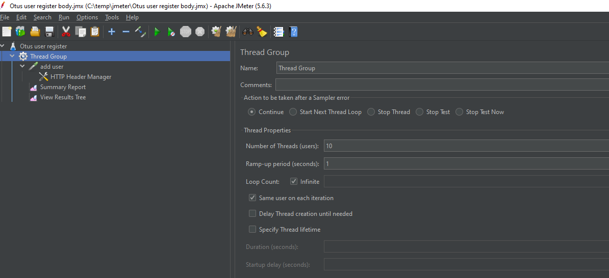
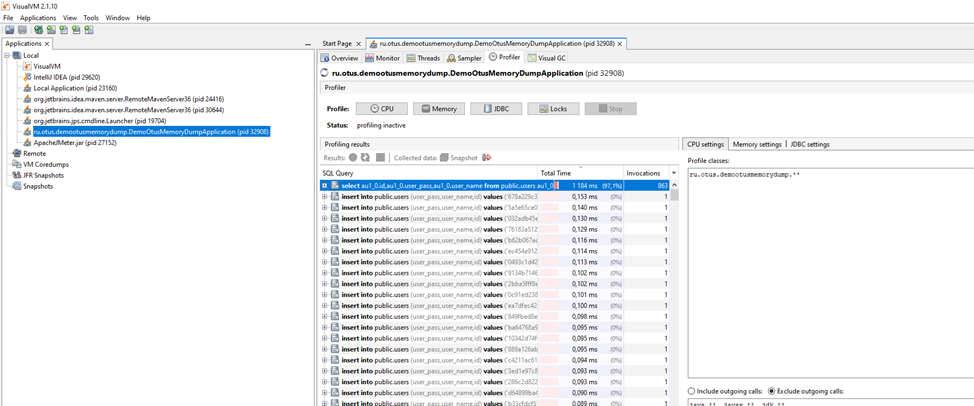
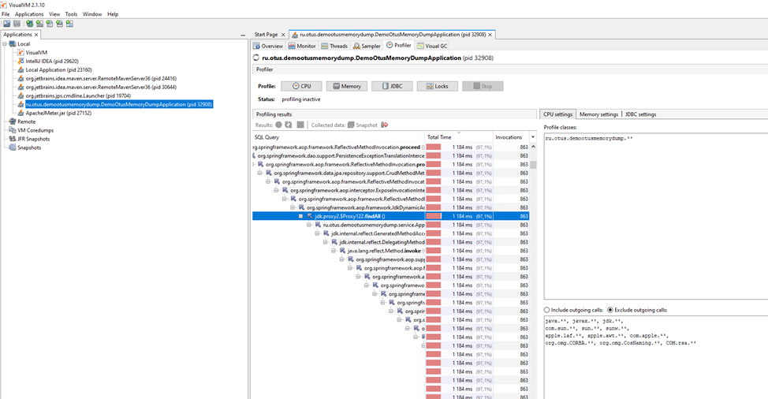
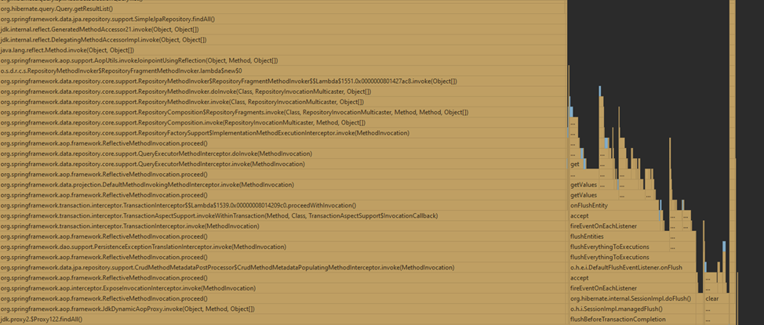
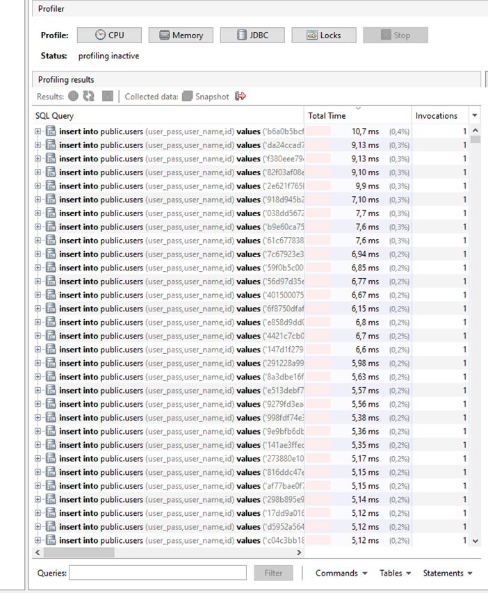

Домашнее задание
Профилирование с помощью visualvm

Цель:
Реализовать тестовый пример, содержащий проблемы, которые потом продемонстрировать в visualvm

Описание/Пошаговая инструкция выполнения домашнего задания:
Для выполнения задания потребуется сервис регистрации пользователя, реализованный ранее.
Написать тестовый профиль с использованием JMeter
Провести профилирование приложения с помощью jvisualvm
Имитировать проблемы в приложении (одну на выбор):
лишние исключения
лишние запросы в БД
ненужные блокировки synchronized или Lock
свои варианты
В readme.md-отчёт приложить flame graph от asyncProfiler'а. Описать словами, где видно подозрение на проблемы с производительностью

Заложенна проблема: лишние запросы в БД

Запускаем приложение, даем нагрузку с помощью Jmeter

Через VisualVm включаем профилирование приложения

Смотрим JDBC Profiler
Видим запрос, который занимает 97,1% времени и имеет самое большое количество Invocations
Это селект, который возвращает список всех регистраций пользователей, которого по логике приложения быть не должно

В раскрывшемся списке находим строчку вызова метода findAll() внутри метода сервиса save

Запускаем приложение "with Windows Async Profiler"

Смотрим получившийся flame graph

Видим широкую и очень высокую область, что явно свидетельствует о наличии проблемы в работе приложения

Вносим исправление в код, смотрим JDBC Profiler

