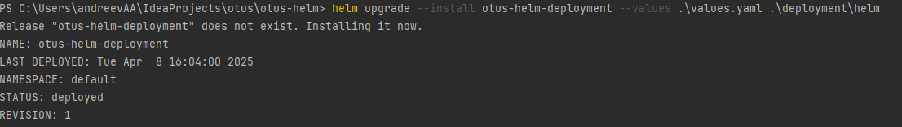
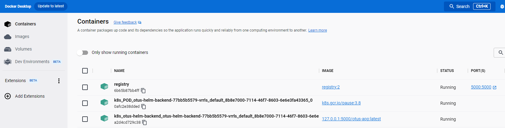
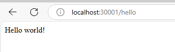

###Docker

1. Собираем jar

`mvn clean package`

2. Собираем образ

`docker image build -t otus-app .`

###Kubernetes

1. local registry

`docker run -d -p 5000:5000 --restart=always --name registry registry:2`

2. push image

`docker tag otus-app:latest 127.0.0.1:5000/otus-app:latest`

`docker push 127.0.0.1:5000/otus-app:latest`

3. deploy in kuber manually

`kubectl create -f .\deployment\deployment.yml`

4. stop manually

`kubectl delete service otus-helm-backend`

`kubectl delete deployment otus-helm-backend`

###Helm

1. template debug

`helm template .\deployment\helm --values .\values.yaml --debug`

2. deploy with helm

`helm upgrade --install otus-helm-deployment --values .\values.yaml .\deployment\helm`

3. uninstall with helm

`helm uninstall otus-helm-deployment`

Screens:

